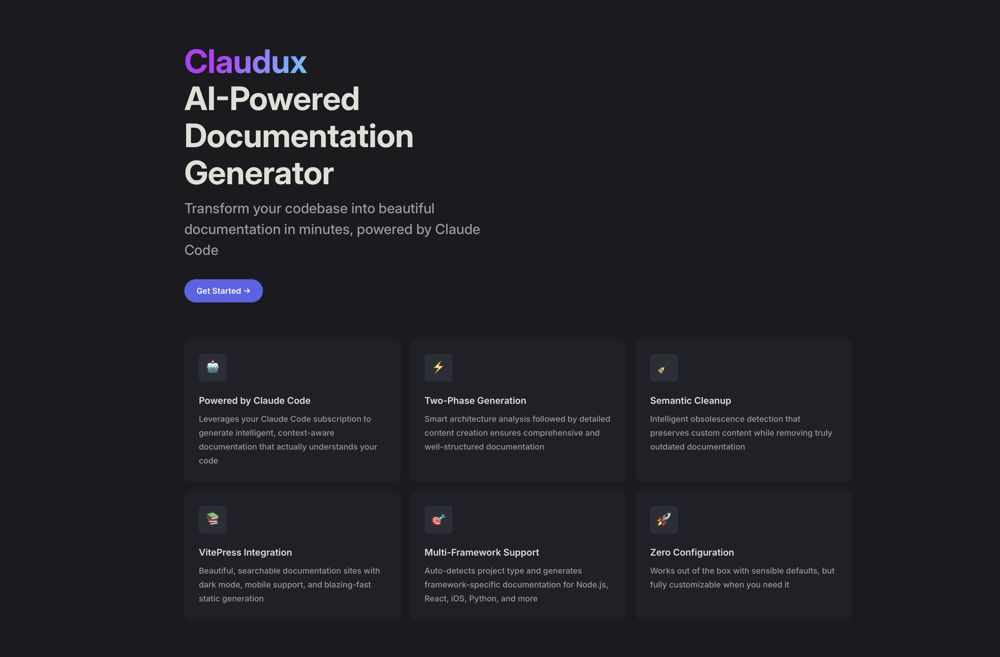

# claudux

Documentation generator that uses AI to analyze your codebase and create VitePress sites. Supports multiple AI backends.

> **See it in action:** [Live documentation](https://leojkwan.github.io/claudux/) (generated by claudux itself)

[](https://www.npmjs.com/package/claudux)
[](https://opensource.org/licenses/MIT)

<p align="center">
  
</p>

## Install

```bash
npm install -g claudux
```

**Requirements:** Node >=18, an authenticated AI CLI ([Claude CLI](https://docs.anthropic.com/claude/docs/claude-cli) or [Codex CLI](https://github.com/openai/codex))

## Usage

```bash
cd your-project
claudux          # Analyze code → generate docs (uses Claude by default)
claudux serve    # Preview at localhost:5173
```

## What it does

- Scans your source code to understand structure and patterns
- Generates a complete VitePress documentation site
- Validates internal links to prevent 404s
- Runs locally -- code never leaves your machine
- Works with multiple AI backends (Claude, Codex)

The generated docs include navigation, search, mobile support, and stay current with your codebase.

## Multi-Backend Support

claudux ships with a backend router that lets you choose which AI powers your documentation generation. Claude is the default; Codex is available as an alternative.

| Backend | Env var | CLI required | Status |
|---------|---------|-------------|--------|
| Claude (default) | `CLAUDUX_BACKEND=claude` | `claude` ([install](https://docs.anthropic.com/claude/docs/claude-cli)) | Stable |
| Codex | `CLAUDUX_BACKEND=codex` | `codex` ([install](https://github.com/openai/codex)) | Phase 1 complete |

### Switch backends

```bash
# Default — uses Claude
claudux update

# Use Codex instead
CLAUDUX_BACKEND=codex claudux update

# Or export for the session
export CLAUDUX_BACKEND=codex
claudux update
```

### Codex-specific settings

When using the Codex backend, you can configure the model and reasoning effort:

```bash
export CLAUDUX_BACKEND=codex
export CODEX_MODEL=gpt-5.4            # default: gpt-5.4
export CODEX_REASONING_EFFORT=xhigh   # default: xhigh
claudux update
```

The Codex adapter runs in non-interactive exec mode with full sandbox access and streams JSONL progress events in real time.

## Example output

```bash
$ claudux update
Starting documentation update...
Model: Claude Sonnet (fast & capable)
Building prompt for javascript project...
Created docs/guide/index.md
Created docs/api/index.md
Validating documentation links... 12/12 valid
Documentation generation complete!
```

## Commands

```bash
claudux                 # Interactive menu
claudux update          # Generate/update docs
claudux update -m "..." # Update with specific focus
claudux serve           # Start dev server
claudux recreate        # Delete docs and start over
claudux check           # Environment diagnostics
claudux template        # Generate claudux.md preferences
claudux --version       # Print version
claudux --help          # Full options
```

## Configuration

Optional `claudux.json` in project root:

```json
{
  "project": {
    "name": "Your Project",
    "type": "react"
  }
}
```

Auto-detects project type from files (React, Next.js, Python, Go, iOS, Android, Rust, Rails, Flutter, etc.).

## Architecture

See [ARCHITECTURE.md](./ARCHITECTURE.md) for the module map, two-phase generation pipeline, and backend router design.

## Documentation

**[Live docs](https://leojkwan.github.io/claudux/)** (generated by claudux itself)

## License

MIT