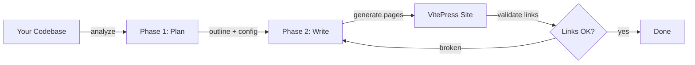

<p align="center">
  
</p>

<p align="center">
  <a href="https://www.npmjs.com/package/claudux"></a>
  <a href="https://www.npmjs.com/package/claudux"></a>
  <a href="https://github.com/leojkwan/claudux/stargazers"></a>
  <a href="LICENSE"></a>
  
</p>

# claudux

Documentation generator that uses Claude AI to analyze your codebase and create VitePress sites.

> **See it in action:** [Live documentation](https://leojkwan.github.io/claudux/) (generated by claudux itself)

## Install

```bash
npm install -g claudux
```

**Requirements:** Node ≥18, [Claude CLI](https://docs.anthropic.com/claude/docs/claude-cli) authenticated

## Usage

```bash
cd your-project
claudux          # Analyze code → generate docs
claudux serve    # Preview at localhost:5173
```

## How It Works

Claudux uses a two-phase flow powered by Claude AI:


```mermaid
flowchart LR
    CODE[Your Codebase] -->|analyze| PLAN[Phase 1: Plan]
    PLAN -->|outline + config| WRITE[Phase 2: Write]
    WRITE -->|generate pages| DOCS[VitePress Site]
    DOCS -->|validate links| CHECK{Links OK?}
    CHECK -->|yes| DONE[Done]
    CHECK -->|broken| WRITE
```

**Phase 1 — Plan:** Scans your source code, detects project type, reads any existing docs or config files (`CLAUDE.md`, `claudux.json`, `.ai-docs-style.md`), and builds a documentation outline with VitePress navigation.

**Phase 2 — Write:** Generates markdown pages with correct cross-references, breadcrumbs, and code examples pulled from your actual codebase. Validates all internal links and auto-fixes broken ones.

Everything runs locally — your code never leaves your machine.

## Example Output

```
$ claudux update
Starting documentation update...
Model: Claude Sonnet (fast & capable)
Building prompt for javascript project...
Created docs/guide/index.md
Created docs/api/index.md
Validating documentation links... 12/12 valid
Documentation generation complete!
```

## Commands

```bash
claudux                 # Interactive menu
claudux update          # Generate/update docs  
claudux update -m "..." # Update with specific focus
claudux serve           # Start dev server
claudux recreate        # Delete docs and start over
claudux --help          # Full options
```

## Configuration

Optional `claudux.json` in project root:

```json
{
  "project": {
    "name": "Your Project", 
    "type": "react"
  }
}
```

Auto-detects project type from files (React, Next.js, Python, Go, etc.).

## Documentation

**[Live docs](https://leojkwan.github.io/claudux/)** (generated by claudux itself)

## License

MIT