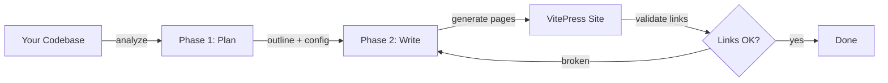
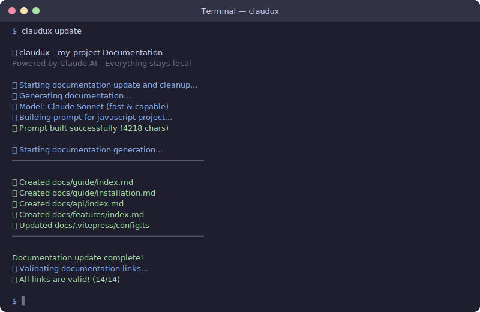

<p align="center">
  
</p>

<p align="center">
  <a href="https://www.npmjs.com/package/claudux"></a>
  <a href="https://www.npmjs.com/package/claudux"></a>
  <a href="https://github.com/leojkwan/claudux/stargazers"></a>
  <a href="LICENSE"></a>
  
</p>

# claudux

Documentation generator that uses AI to analyze your codebase and create VitePress sites. Supports multiple AI backends.

> **See it in action:** [Live documentation](https://leojkwan.github.io/claudux/) (generated by claudux itself)

## Install

```bash
npm install -g claudux
```

**Requirements:** Node >=18, an authenticated AI CLI ([Claude CLI](https://docs.anthropic.com/claude/docs/claude-cli) or [Codex CLI](https://github.com/openai/codex))

## Usage

```bash
cd your-project
claudux          # Analyze code → generate docs (uses Claude by default)
claudux serve    # Preview at localhost:5173
```

## How It Works

Claudux uses a two-phase flow:


```mermaid
flowchart LR
    CODE[Your Codebase] -->|analyze| PLAN[Phase 1: Plan]
    PLAN -->|outline + config| WRITE[Phase 2: Write]
    WRITE -->|generate pages| DOCS[VitePress Site]
    DOCS -->|validate links| CHECK{Links OK?}
    CHECK -->|yes| DONE[Done]
    CHECK -->|broken| WRITE
```

**Phase 1 — Plan:** Scans your source code, detects project type, reads any existing docs or config files (`CLAUDE.md`, `claudux.json`, `.ai-docs-style.md`), and builds a documentation outline with VitePress navigation.

**Phase 2 — Write:** Generates markdown pages with correct cross-references, breadcrumbs, and code examples pulled from your actual codebase. Validates all internal links and auto-fixes broken ones.

Everything runs locally — your code never leaves your machine.

## Multi-Backend Support

claudux ships with a backend router that lets you choose which AI powers your documentation generation. Claude is the default; Codex is available as an alternative.

| Backend | Env var | CLI required | Status |
|---------|---------|-------------|--------|
| Claude (default) | `CLAUDUX_BACKEND=claude` | `claude` ([install](https://docs.anthropic.com/claude/docs/claude-cli)) | Stable |
| Codex | `CLAUDUX_BACKEND=codex` | `codex` ([install](https://github.com/openai/codex)) | Phase 1 complete |

### Switch backends

```bash
# Default — uses Claude
claudux update

# Use Codex instead
CLAUDUX_BACKEND=codex claudux update

# Or export for the session
export CLAUDUX_BACKEND=codex
claudux update
```

### Codex-specific settings

When using the Codex backend, you can configure the model and reasoning effort:

```bash
export CLAUDUX_BACKEND=codex
export CODEX_MODEL=gpt-5.4            # default: gpt-5.4
export CODEX_REASONING_EFFORT=xhigh   # default: xhigh
claudux update
```

The Codex adapter runs in non-interactive exec mode with full sandbox access and streams JSONL progress events in real time.

## Demo

<p align="center">
  
</p>

## Commands

```bash
claudux                 # Interactive menu
claudux update          # Generate/update docs
claudux update -m "..." # Update with specific focus
claudux serve           # Start dev server
claudux diff            # Files changed since last doc gen
claudux status          # Documentation freshness
claudux validate        # Check internal links
claudux check           # Verify environment (Node, CLI, docs)
claudux template        # Generate claudux.md preferences
claudux recreate        # Delete docs and start over
claudux --version       # Show installed version
claudux --help          # Full options
```

## How Claudux Compares

| | Claudux | TypeDoc / JSDoc | Docusaurus | Manual docs |
|---|---|---|---|---|
| **Input** | Your actual codebase | Type annotations only | Manually written MDX | Manually written |
| **Output** | Full VitePress site | API reference only | Whatever you write | Whatever you write |
| **Maintenance** | Re-run `claudux update` | Rebuild on change | Edit by hand | Edit by hand |
| **AI-aware** | Yes — reads code structure and patterns | No | No | No |
| **Link validation** | Built-in with auto-fix | No | Build-time only | No |

Claudux doesn't replace API reference generators — it generates the docs you never write: guides, architecture overviews, getting started pages. Run it alongside TypeDoc, not instead of it.

## Sibling Project

**[vidux](https://github.com/leojkwan/vidux)** — plan-first orchestration for AI coding agents. If claudux is "docs before code," vidux is "plan before code." Same philosophy, different surface.

## Configuration

Optional `claudux.json` in project root:

```json
{
  "project": {
    "name": "Your Project",
    "type": "react"
  }
}
```

Auto-detects project type from files (React, Next.js, Python, Go, iOS, Android, Rust, Rails, Flutter, etc.).

## Architecture

See [ARCHITECTURE.md](./ARCHITECTURE.md) for the module map, two-phase generation pipeline, and backend router design.

## Documentation

**[Live docs](https://leojkwan.github.io/claudux/)** (generated by claudux itself)

## License

MIT