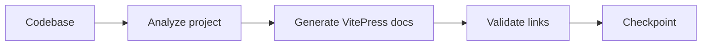
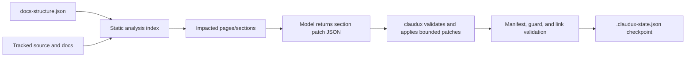

<p align="center">
  
</p>

<p align="center">
  <a href="https://www.npmjs.com/package/claudux"></a>
  <a href="https://www.npmjs.com/package/claudux"></a>
  <a href="https://github.com/leojkwan/claudux/stargazers"></a>
  <a href="LICENSE"></a>
  
</p>

# claudux

Claudux is a local CLI for generating and maintaining VitePress documentation from a codebase. It can use Claude by default or Codex with `CLAUDUX_BACKEND=codex`.

Current versions also support deterministic docs mode: when a repository checks in `docs-structure.json`, claudux treats the docs tree as source-owned state, builds a static analysis index before model invocation, and applies model output through bounded section patches instead of broad rewrites.

> **See it in action:** [Live documentation](https://leojkwan.github.io/claudux/) (generated by claudux itself)

## Install

```bash
npm install -g claudux
```

Requirements:

- Node.js >= 18
- An authenticated AI CLI:
  - Claude CLI for the default backend
  - Codex CLI for `CLAUDUX_BACKEND=codex`

Claudux runs as a local shell tool. The selected AI CLI still receives the prompt context claudux gives it, according to that backend's own authentication, transport, and data handling behavior.

## Quick Start

```bash
cd your-project

# Generate or update docs.
claudux update

# Preview the VitePress site.
claudux serve

# Validate generated docs without regenerating.
claudux validate
```

Use a focused directive when you know what changed:

```bash
claudux update -m "Document the new authentication flow"
claudux update --with "Refresh CLI command docs from bin/claudux"
```

## How It Works

Without a manifest, claudux follows the classic generate/update flow:


```mermaid
flowchart LR
    CODE["Codebase"] --> PLAN["Analyze project"]
    PLAN --> WRITE["Generate VitePress docs"]
    WRITE --> VALIDATE["Validate links"]
    VALIDATE --> DONE["Checkpoint"]
```

With `docs-structure.json`, claudux uses the deterministic flow:


```mermaid
flowchart LR
    MANIFEST["docs-structure.json"] --> INDEX["Static analysis index"]
    CODE["Tracked source and docs"] --> INDEX
    INDEX --> IMPACT["Impacted pages/sections"]
    IMPACT --> PATCH["Model returns section patch JSON"]
    PATCH --> APPLY["claudux validates and applies bounded patches"]
    APPLY --> GUARD["Manifest, guard, and link validation"]
    GUARD --> STATE[".claudux-state.json checkpoint"]
```

Deterministic mode is meant for larger repos where the structure of the documentation is part of the product:

- `docs-structure.json` owns page IDs, paths, navigation order, source ownership, deletion policy, and required sections.
- `.claudux/index/static-analysis.json` records sorted, hash-based facts about tracked source files, docs files, package scripts, shell dependencies, headings, links, and manifest ownership.
- `.claudux/index/impacted-docs.json` maps changed files through manifest `source_patterns` and dependency edges to the docs that may be stale.
- The model returns JSON between `CLAUDUX_SECTION_PATCHES_JSON_START` and `CLAUDUX_SECTION_PATCHES_JSON_END`.
- Claudux applies only validated patches to manifest-owned generated sections.
- Pinned sections, read-only sections, and skip-marker blocks are guarded before and after generation.
- AI cleanup paths and `claudux recreate` are blocked from deleting manifest-owned docs unless explicitly unlocked with environment overrides.

The model can propose wording. The repository owns structure.

## Backends

| Backend | Select with | CLI required | Notes |
|---------|-------------|--------------|-------|
| Claude | default or `CLAUDUX_BACKEND=claude` | `claude` | Default backend. Uses `FORCE_MODEL=sonnet` unless overridden. |
| Codex | `CLAUDUX_BACKEND=codex` | `codex` | Supported backend. Defaults to `gpt-5.4` with `xhigh` reasoning. |

```bash
# Default: Claude
claudux update

# Codex
CLAUDUX_BACKEND=codex claudux update

# Codex settings
export CLAUDUX_BACKEND=codex
export CODEX_MODEL=gpt-5.4
export CODEX_REASONING_EFFORT=xhigh
claudux update
```

Codex runs through `codex exec --json` with `approval_policy="never"`. Its default sandbox is `danger-full-access`; when claudux enters manifest section-patch mode, it requests a read-only sandbox unless `CODEX_SANDBOX_MODE` is set.

## Commands

```bash
claudux                 # Interactive menu
claudux update          # Generate or update docs
claudux update -m "..." # Update with a focused directive
claudux update --strict # Fail if internal links remain broken
claudux serve           # Start the VitePress dev server
claudux diff            # Show files changed since the last checkpoint
claudux status          # Show documentation freshness
claudux validate        # Validate manifest and internal links
claudux check           # Verify Node, backend CLI, and docs state
claudux template        # Generate claudux.md preferences
claudux recreate        # Delete docs and regenerate, unless manifest guard blocks it
claudux --version       # Show installed version
claudux --help          # Show help
```

`claudux diff` and `claudux status` read `.claudux-state.json`, which is local per developer and ignored by git.

## Configuration

Optional `claudux.json` in the project root:

```json
{
  "project": {
    "name": "Your Project",
    "type": "react"
  }
}
```

Common config files:

- `claudux.json` sets project metadata and type overrides.
- `claudux.md` stores documentation preferences generated by `claudux template`.
- `docs-structure.json` is the deterministic manifest for repos that want pinned pages, source-owned sections, bounded patching, and deletion guards.

Claudux auto-detects common project types from repo files, including React, Next.js, JavaScript, Node.js, Python, Go, iOS, Android, Rust, Rails, and Flutter.

## Content Protection

Claudux automatically protects sensitive paths such as `notes/`, `private/`, `.git/`, `node_modules/`, `*.env`, `*.key`, and `*.pem`.

Use skip markers to protect specific blocks:

```markdown
<!-- skip -->
This block is preserved by claudux.
<!-- /skip -->
```

Language-specific marker pairs are supported for common source files, including `// skip`, `# skip`, `/* skip */`, and `-- skip`.

In deterministic mode, skip-marker hashes are captured in the guard snapshot so protected blocks cannot be changed silently during generation.

## How Claudux Compares

| | Claudux | TypeDoc / JSDoc | Docusaurus | Manual docs |
|---|---|---|---|---|
| **Input** | Source code, existing docs, optional manifest | Type annotations and comments | Hand-written docs | Hand-written docs |
| **Output** | VitePress site | API reference | Static docs site | Any format |
| **Maintenance** | Re-run `claudux update` | Rebuild on code change | Edit by hand | Edit by hand |
| **AI backend** | Claude or Codex CLI | None | None by default | None |
| **Link validation** | Built in | Generator-specific | Build-time | Manual |
| **Structure guardrails** | Optional manifest, pinned sections, bounded patches | No | Config-owned navigation | Manual review |

Claudux is not an API reference generator. It is designed for guides, architecture pages, command references, and source-aware maintenance docs. It can run alongside TypeDoc, JSDoc, or other reference generators.

## Demo

<p align="center">
  
</p>

## Project Docs

- [Live docs](https://leojkwan.github.io/claudux/)
- [Architecture](./ARCHITECTURE.md)
- [Deterministic generation](./docs/technical/deterministic-generation.md)

## Sibling Project

**[vidux](https://github.com/leojkwan/vidux)** is plan-first orchestration for AI coding agents. Claudux handles docs; vidux handles planning.

## License

MIT
