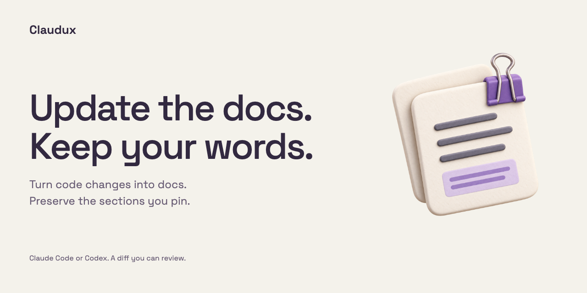
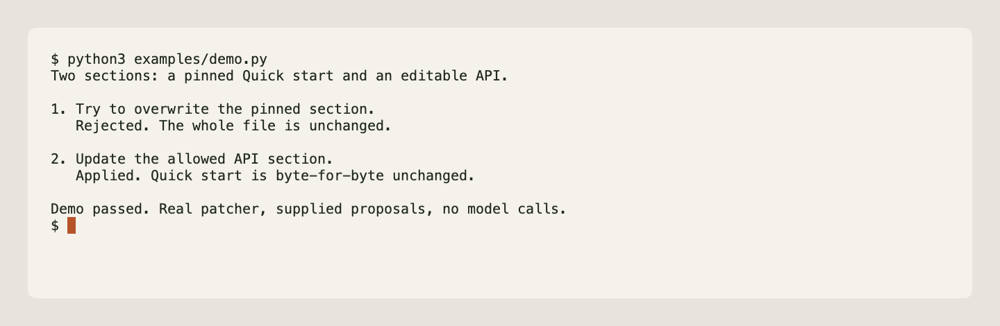

# Claudux

**Update the docs. Keep the words you pinned.**

Claudux uses your Claude Code or Codex CLI to turn code changes into VitePress
documentation. Commit a manifest to choose which sections may change and which
must stay byte-for-byte intact. Review the resulting diff before you commit.

[Try the local demo](#try-it-without-a-model-call) ·
[Read the guide](https://firstbitelabsllc.github.io/claudux/) ·
[Report a problem](https://github.com/firstbitelabsllc/claudux/issues)



## Try it without a model call

Python 3, Node 18+, and Bash. This example runs the real section patcher with
two supplied proposals in a temporary folder. It rejects an edit to a pinned
Quick start, then updates the API section and checks the preserved bytes.

```bash
git clone https://github.com/firstbitelabsllc/claudux.git
cd claudux
python3 examples/demo.py
```

[Watch the recording](docs/public/claudux-demo.mp4) ·
[Reproduce the capture](docs/capture.md)

## Use it in your project

Install with Node 18+ and a Claude Code or Codex CLI you are logged into:

```bash
curl -fsSL https://raw.githubusercontent.com/firstbitelabsllc/claudux/main/install.sh | sh
cd your-project
claudux check
claudux update -m "Document the API changes in this branch."
claudux serve
```

`update` uses your model allowance. `serve` opens a local preview.
Before your first update, read the [manifest guide](docs/technical/deterministic-generation.md)
if you want to protect handwritten sections. Without a manifest, the backend
writes documentation directly; it does not infer which paragraphs you meant to keep.

## Give each section a boundary

In a committed `docs-structure.json`, a page can declare:

```json
"sections": [
  { "id": "quick-start", "heading": "Quick start", "level": 2, "pinned": true },
  { "id": "api", "heading": "API", "level": 2, "source_patterns": ["src/**"] }
]
```

In manifest mode the backend returns section patches. Claudux checks targets,
source ownership, headings, and protected hashes before applying the batch.
These checks protect the editing boundary; they cannot establish that the
generated explanation is correct.

A [recorded real update](evidence/real-target-lifecycle.md) documents a new API
while preserving a pinned guide. That receipt includes the model run, a rejected
out-of-bounds write, and the resulting docs build.

## Keep going

[Commands](docs/guide/commands.md) · [Configuration](docs/guide/configuration.md) ·
[Architecture](ARCHITECTURE.md) · [Contributing](CONTRIBUTING.md) ·
[Security](SECURITY.md) · [MIT license](LICENSE)
