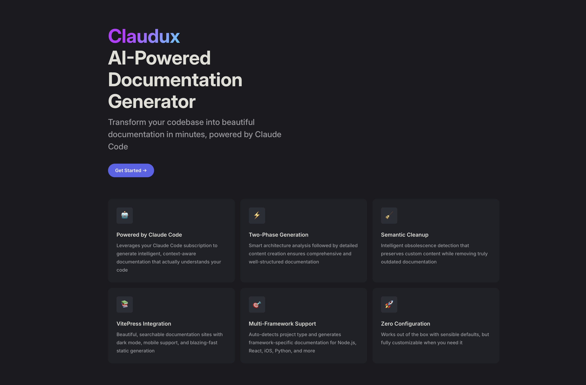

# 🚀 Claudux — Supercharge Your Docs with Claude Code

> Transform your codebase into cohesive, elegant documentation in minutes — powered by Claude Code.

[](https://www.npmjs.com/package/claudux)
[](https://opensource.org/licenses/MIT)

<p align="center">
  <!-- Replace ./assets/readme-hero.png with your screenshot (recommended: 1600×900, .webp or .png) -->
  
</p>

## 💡 Why Claudux?

Ever spent hours writing documentation that becomes outdated the moment you push code? **Claudux** leverages your Claude Code subscription to automatically generate and maintain comprehensive documentation that actually stays in sync with your code.

### 🎯 Built for Claude Code users

- **Same AI, new superpower**: the assistant that helps you code now maintains your docs
- **Context-aware**: reads your codebase to generate accurate, cohesive docs
- **Stays current**: update docs with a single command as your code evolves

## 🌟 Get started in 30 seconds

```bash
# Install (global)
npm install -g claudux

# Or install from GitHub
npm install -g github:leokwan/claudux

# Generate docs for a project
cd your-project
claudux update

# Preview locally
claudux serve  # http://localhost:5173
```

## 📚 Documentation

- Browse in-repo: [`docs/index.md`](docs/index.md)
- Quick links:
  - Guide: [Installation](docs/guide/installation.md) · [Quick Start](docs/guide/quickstart.md) · [Configuration](docs/guide/configuration.md) · [Commands](docs/guide/commands.md)
  - Features: [Two-Phase Generation](docs/features/two-phase-generation.md) · [Smart Cleanup](docs/features/smart-cleanup.md) · [VitePress Integration](docs/features/vitepress-integration.md)
  - API: [CLI](docs/api/cli.md) · [Library](docs/api/library.md)
  - Technical: [Architecture](docs/technical/index.md) · [Patterns](docs/technical/patterns.md) · [Modules](docs/technical/modules.md)
  - Examples: [Basic Setup](docs/examples/basic-setup.md) · [Advanced Usage](docs/examples/advanced-usage.md)
  - Help: [FAQ](docs/faq.md) · [Troubleshooting](docs/troubleshooting.md)

When you’re ready to host, point your DNS to your static site (VitePress). The docs config is already set up; run `claudux serve` to preview.

## 🧠 Powered by Claude Code

Claudux runs a two-phase flow to produce high‑quality docs:

1. **Architecture analysis**: reads your codebase, builds a structured plan, and generates a VitePress config with zero broken links
2. **Content creation**: writes the docs with cohesive narrative, correct links, and breadcrumbs

## 🎨 Features

- **AI‑powered**: Claude Code generates and updates docs using your actual code
- **Smart cleanup**: semantic obsolescence detection (not just regex)
- **VitePress‑ready**: ships with a clean config, search, edit links, and nice defaults
- **Two‑phase generation**: planning + execution in one run
- **Auto‑detection**: determines project type and structure to tailor docs

## ✅ Requirements

- Node.js ≥ 14
- Claude CLI installed and authenticated (`claude config get`)

## 🛠️ Commands

```bash
claudux                   # Interactive menu
claudux update            # Generate/update docs (two‑phase, with cleanup)
claudux update -m "..."   # Update with a focused directive for Claude
claudux serve             # Start dev server (localhost:5173)
claudux validate          # Validate links in docs
claudux repair            # Validate and auto‑create missing pages
claudux clean             # Remove obsolete files only
claudux recreate          # Start fresh (delete all docs)
claudux template          # Analyze codebase and generate CLAUDE.md
claudux help              # Show help
```

## 🔧 Configuration

Create a `docs-ai-config.json` in your project root:

```json
{
  "projectName": "Your Awesome Project",
  "primaryLanguage": "typescript",
  "frameworks": ["react", "nextjs"],
  "features": {
    "apiDocs": true,
    "tutorials": true,
    "examples": true
  }
}
```

## 🖼️ Screenshot placement (for README and docs)

- README hero image: drop a file at `assets/readme-hero.png` and it will render above.
  - Recommended: 1600×900, `.webp` preferred; keep text minimal and legible.
  - You can also host it on GitHub and reference: `https://raw.githubusercontent.com/leokwan/claudux/main/assets/readme-hero.png`.
- Docs social card (optional): place `docs/public/og-image.png` and add to the docs config if you want rich link previews.
  - Example meta tag to add in `docs/.vitepress/config.ts` head: `['meta', { property: 'og:image', content: '/og-image.png' }]`.

## 🤝 Contributing

We love contributions! See [CONTRIBUTING.md](CONTRIBUTING.md) for guidelines.

## 📄 License

MIT - See [LICENSE](LICENSE) for details

---

<p align="center">
  <strong>Ready to revolutionize your documentation workflow?</strong><br>
  <a href="https://claude.ai/code">Get Claude Code</a> • 
  <a href="https://github.com/leokwan/claudux">Star on GitHub</a> • 
  <a href="https://github.com/leokwan/claudux/issues">Report Issues</a>
</p>

<p align="center">
  <em>Built with ❤️ by developers who believe great code deserves great docs</em>
</p>