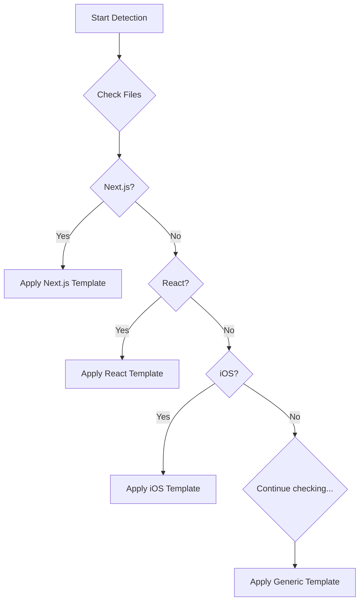

[Home](/) > [Features](/features/) > Project Detection

# Project Auto-Detection

Claudux automatically identifies your project type and applies appropriate documentation templates, ensuring generated docs match your framework's conventions and best practices.

## How It Works

Project detection follows a priority-based pattern matching system:



## Detection Implementation

From `lib/project.sh`:

```bash
detect_project_type() {
    # Next.js (highest priority)
    if [[ -f "next.config.js" ]] || [[ -f "next.config.ts" ]]; then
        echo "nextjs"
        return
    fi
    
    # React
    if [[ -f "package.json" ]] && grep -q '"react"' package.json; then
        echo "react"
        return
    fi
    
    # iOS/Swift
    if ls *.xcodeproj >/dev/null 2>&1 || [[ -f "Package.swift" ]]; then
        echo "ios"
        return
    fi
    
    # Python
    if [[ -f "setup.py" ]] || [[ -f "pyproject.toml" ]]; then
        echo "python"
        return
    fi
    
    # Continue for other types...
    echo "generic"
}
```

## Supported Project Types

### React Applications

**Detection Criteria:**
- `package.json` contains `"react"`
- `.jsx` or `.tsx` files present
- `src/App.js` or `src/App.tsx` exists

**Template Features:**
- Component documentation
- Hooks reference
- Props documentation
- State management guides
- Testing with RTL

### Next.js Applications

**Detection Criteria:**
- `next.config.js` or `next.config.ts`
- `pages/` or `app/` directory
- `package.json` contains `"next"`

**Template Features:**
- Page routing docs
- API routes reference
- SSR/SSG/ISR guides
- Middleware documentation
- Deployment to Vercel

### iOS/Swift Projects

**Detection Criteria:**
- `.xcodeproj` or `.xcworkspace` files
- `Package.swift` (Swift Package Manager)
- `.swift` files in project root

**Template Features:**
- SwiftUI/UIKit documentation
- Core Data guides
- Dependency documentation
- Testing with XCTest
- App Store guidelines

### Python Packages

**Detection Criteria:**
- `setup.py` or `pyproject.toml`
- `requirements.txt` or `Pipfile`
- `__init__.py` in subdirectories

**Template Features:**
- Module documentation
- Class and function reference
- Type hints documentation
- Testing with pytest
- Package distribution

### Rust Projects

**Detection Criteria:**
- `Cargo.toml` file
- `src/main.rs` or `src/lib.rs`

**Template Features:**
- Crate documentation
- Module structure
- Trait documentation
- Example usage
- Cargo commands

### Go Modules

**Detection Criteria:**
- `go.mod` file
- `.go` files in root

**Template Features:**
- Package documentation
- Interface definitions
- Concurrent patterns
- Testing guides
- Module management

### Ruby/Rails

**Detection Criteria:**
- `Gemfile` present
- `config/application.rb` (Rails)
- `.rb` files

**Template Features:**
- Gem documentation
- Rails guides
- ActiveRecord models
- Controller/View docs
- RSpec testing

### Android Projects

**Detection Criteria:**
- `build.gradle` or `build.gradle.kts`
- `AndroidManifest.xml`
- `settings.gradle`

**Template Features:**
- Activity/Fragment docs
- ViewModel patterns
- Dependency injection
- Testing guides
- Play Store deployment

### Flutter Applications

**Detection Criteria:**
- `pubspec.yaml` file
- `lib/main.dart`
- Flutter SDK markers

**Template Features:**
- Widget documentation
- State management
- Platform channels
- Testing guides
- Deployment docs

## Template Structure

Each project type has a specialized template:

```
lib/templates/
├── react-project-config.json
├── react/
│   ├── sidebar.json
│   └── claude.md
├── nextjs-project-config.json
├── ios-project-config.json
├── python-project-config.json
└── generic-project-config.json
```

### Template Configuration

Example `react-project-config.json`:

```json
{
  "project": {
    "type": "react",
    "name": "React Application",
    "description": "React-based web application"
  },
  "documentation": {
    "sections": [
      "components",
      "hooks", 
      "state-management",
      "routing",
      "testing"
    ],
    "apiStyle": "jsx-props",
    "exampleFormat": "functional-components"
  },
  "features": {
    "storybook": "auto-detect",
    "testing": "jest-rtl",
    "styling": "auto-detect"
  }
}
```

## Priority System

Projects are checked in order of specificity:

1. **Framework-specific** (Next.js, Rails, Flutter)
2. **Language-specific with framework** (React, Vue, Angular)
3. **Language-specific** (Python, Rust, Go)
4. **Generic with indicators** (package.json, Makefile)
5. **Fallback** (generic template)

## Auto-Detection Examples

### Example 1: Next.js E-commerce

```bash
$ claudux update
🔍 Detecting project type...
✓ Found: next.config.js
✓ Found: pages/ directory
✓ Type: Next.js application

📝 Applying Next.js template...
✓ Generating page documentation
✓ Documenting API routes
✓ Creating deployment guide
```

### Example 2: Python Library

```bash
$ claudux update  
🔍 Detecting project type...
✓ Found: setup.py
✓ Found: src/__init__.py
✓ Type: Python package

📝 Applying Python template...
✓ Generating module docs
✓ Creating API reference
✓ Adding type hints documentation
```

### Example 3: Monorepo

```bash
$ claudux update
🔍 Detecting project type...
✓ Found: packages/ directory
✓ Found: lerna.json
✓ Type: Monorepo

📝 Applying Monorepo template...
✓ Documenting each package
✓ Creating cross-references
✓ Generating workspace docs
```

## Custom Detection

### Adding New Project Types

1. Create detection logic in `lib/project.sh`:

```bash
# Add to detect_project_type()
if [[ -f "deno.json" ]] || [[ -f "deno.jsonc" ]]; then
    echo "deno"
    return
fi
```

2. Create template configuration:

```json
// lib/templates/deno-project-config.json
{
  "project": {
    "type": "deno",
    "name": "Deno Application"
  }
}
```

3. Add template instructions:

```markdown
<!-- lib/templates/deno-claude.md -->
# Deno Project Instructions

Focus on:
- TypeScript-first documentation
- Deno-specific APIs
- Permission model
- Deployment to Deno Deploy
```

### Override Detection

Force a specific project type:

```json
// docs-ai-config.json
{
  "projectType": "react",
  "forceTemplate": true
}
```

Or via command line:

```bash
claudux update --project-type react
```

## Detection Indicators

### File Indicators

Common files that indicate project type:

| File | Project Type |
|------|-------------|
| `package.json` | Node.js/JavaScript |
| `Cargo.toml` | Rust |
| `go.mod` | Go |
| `pom.xml` | Java/Maven |
| `build.gradle` | Java/Gradle |
| `Gemfile` | Ruby |
| `requirements.txt` | Python |
| `composer.json` | PHP |

### Directory Indicators

| Directory | Project Type |
|-----------|-------------|
| `src/components/` | React/Vue |
| `pages/` | Next.js |
| `app/` | Rails/Next.js 13+ |
| `lib/` | Ruby/Dart |
| `pkg/` | Go |
| `Sources/` | Swift |

### Content Indicators

The tool also examines file contents:

```bash
# Check package.json dependencies
if grep -q '"@angular/core"' package.json; then
    echo "angular"
fi

# Check for framework markers
if grep -r "extends Component" --include="*.js"; then
    echo "react-class-components"
fi
```

## Multi-Framework Projects

Handles projects with multiple frameworks:

```bash
detect_frameworks() {
    local frameworks=()
    
    # Backend
    if [[ -f "server.js" ]]; then
        frameworks+=("express")
    fi
    
    # Frontend
    if [[ -d "client/src/components" ]]; then
        frameworks+=("react")
    fi
    
    # Mobile
    if [[ -d "ios/" && -d "android/" ]]; then
        frameworks+=("react-native")
    fi
    
    echo "${frameworks[@]}"
}
```

## Benefits of Auto-Detection

### Appropriate Documentation Structure

Each project type gets relevant sections:
- React: Components, Hooks, Context
- Python: Modules, Classes, Functions
- iOS: Views, Models, Controllers

### Correct Terminology

Uses framework-specific terms:
- React: "props", "state", "hooks"
- Python: "modules", "packages", "methods"
- iOS: "views", "delegates", "protocols"

### Relevant Examples

Generates appropriate code examples:
- React: JSX components
- Python: Class definitions
- iOS: Swift/SwiftUI code

### Framework-Specific Features

Includes relevant tooling:
- React: Storybook, Testing Library
- Python: pytest, setuptools
- iOS: XCTest, Instruments

## Configuration

### Manual Override

Override detection in `docs-ai-config.json`:

```json
{
  "projectType": "custom",
  "template": "my-template",
  "detection": {
    "enabled": false
  }
}
```

### Detection Hints

Provide hints for better detection:

```json
{
  "hints": {
    "framework": "vue",
    "language": "typescript",
    "testing": "vitest"
  }
}
```

## Troubleshooting

### Wrong Type Detected

Check detection:
```bash
claudux check
```

Force correct type:
```bash
claudux update --project-type react
```

### Missing Detection

Add detection hints:
```json
{
  "projectType": "react",
  "frameworks": ["react", "redux", "webpack"]
}
```

### Custom Projects

For unique projects, use generic template with customization:

```bash
claudux template  # Generate CLAUDE.md
# Edit CLAUDE.md with project specifics
claudux update
```

## Future Enhancements

### Planned Improvements

- Machine learning-based detection
- Multi-language project support
- Microservices architecture detection
- Cloud platform detection (AWS, GCP, Azure)
- Build tool detection and documentation

## Conclusion

Project auto-detection ensures your documentation matches your project's specific needs, conventions, and best practices. By automatically identifying project types and applying appropriate templates, Claudux generates documentation that feels native to your technology stack.

## See Also

- [Configuration](/guide/configuration) - Override detection settings
- [Templates](#) - Available project templates
- [Two-Phase Generation](/features/two-phase-generation) - How templates are applied