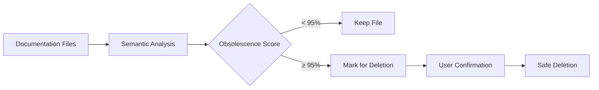

[Home](/) > [Features](/features/) > Smart Cleanup

# Smart Cleanup

Claudux's smart cleanup feature uses semantic analysis to identify and remove obsolete documentation with 95% confidence, while preserving your custom content and maintaining documentation integrity.

## The Problem with Traditional Cleanup

Most documentation tools use simple pattern matching:
- Delete files not in a manifest
- Remove files older than X days
- Clear entire directories

This approach often:
- ❌ Deletes custom documentation
- ❌ Removes still-relevant content
- ❌ Breaks cross-references
- ❌ Ignores semantic meaning

## The Claudux Approach

Smart cleanup uses AI-powered semantic analysis:



## How It Works

### 1. Codebase Analysis

First, Claudux analyzes your current code:

```bash
# Scan current codebase structure
analyze_current_state() {
    local components=$(find src -name "*.jsx" -o -name "*.tsx")
    local apis=$(grep -r "export.*function" --include="*.js")
    local features=$(detect_features)
    
    build_current_map "$components" "$apis" "$features"
}
```

### 2. Documentation Scanning

Then, it scans existing documentation:

```bash
# Scan documentation files
scan_documentation() {
    for doc in docs/**/*.md; do
        extract_references "$doc"
        identify_topics "$doc"
        check_code_examples "$doc"
    done
}
```

### 3. Semantic Comparison

AI compares documentation against code:

```bash
# Semantic obsolescence detection
detect_obsolete() {
    local doc="$1"
    local confidence=$(calculate_obsolescence_score "$doc")
    
    if [[ $confidence -ge 0.95 ]]; then
        mark_obsolete "$doc" "$confidence"
    fi
}
```

### 4. Protected Content Check

Never deletes protected content:

```bash
# Check protection patterns
is_protected() {
    local file="$1"
    
    # Check built-in patterns
    if matches_protected_pattern "$file"; then
        return 0
    fi
    
    # Check custom markers
    if contains_protection_marker "$file"; then
        return 0
    fi
    
    return 1
}
```

## Obsolescence Detection

### Confidence Scoring

Each file gets an obsolescence score based on:

| Factor | Weight | Description |
|--------|--------|-------------|
| Missing References | 40% | Code references no longer exist |
| Outdated Examples | 30% | Code examples don't match current code |
| Broken Links | 20% | Links point to non-existent pages |
| Stale Metadata | 10% | Old versions, deprecated flags |

### Example Scoring

```markdown
# Component: OldButton (OBSOLETE: 98% confidence)

Reasons:
- Component src/components/OldButton.jsx not found (40%)
- Import pattern `import OldButton` not found (30%)
- Links to /api/old-button broken (20%)
- Marked deprecated in v1.0, current v3.0 (8%)

Total: 98% confidence obsolete
```

## Protection Mechanisms

### Built-in Protected Patterns

Never deletes:
```
.git/
node_modules/
.env*
private/
secret/
notes/
*.key
*.pem
*-protected.*
```

### Custom Protection Markers

Protect sections with markers:

```markdown
<!-- CLAUDUX:PROTECTED:START -->
This custom documentation will never be deleted.
Add your hand-written guides, notes, or special content here.
<!-- CLAUDUX:PROTECTED:END -->
```

### .clauduxignore File

Add custom patterns:

```gitignore
# Protected directories
internal-docs/
architecture-decisions/

# Protected files
CHANGELOG.md
ROADMAP.md
*-manual.md

# Protected patterns
docs/archive/**
docs/legacy/**
```

## Usage

### Basic Cleanup

```bash
claudux clean
```

Interactive output:
```
🧹 Analyzing documentation for obsolete content...

Found 5 potentially obsolete files:

1. docs/api/v1-endpoints.md (98% obsolete)
   - References removed API endpoints
   
2. docs/components/deprecated-table.md (96% obsolete)
   - Component no longer exists
   
3. docs/guides/old-setup.md (95% obsolete)
   - Setup process completely changed

Files to keep:
- docs/guides/migration.md (Protected: custom content)
- docs/archive/* (Protected: archive pattern)

Delete 3 obsolete files? (y/N):
```

### Dry Run Mode

Preview without deleting:

```bash
claudux clean --dry-run
```

Output:
```
🔍 DRY RUN - No files will be deleted

Would delete:
- docs/api/v1-endpoints.md
- docs/components/deprecated-table.md
- docs/guides/old-setup.md

Would keep:
- docs/guides/migration.md (protected)
- docs/api/current.md (still referenced)
```

### Force Mode

Skip confirmation:

```bash
claudux clean --force
```

### Adjust Threshold

Change confidence threshold:

```bash
# More aggressive (90% confidence)
claudux clean --threshold 0.9

# More conservative (99% confidence)
claudux clean --threshold 0.99
```

## Implementation

### Core Function

From `lib/cleanup.sh`:

```bash
cleanup_docs() {
    show_header
    
    if [[ ! -d "docs" ]]; then
        info "No documentation directory found"
        return 0
    fi
    
    print_color "YELLOW" "🧹 Analyzing documentation..."
    
    # Get obsolete files list
    local obsolete_files=$(analyze_obsolete_docs)
    
    if [[ -z "$obsolete_files" ]]; then
        success "✅ No obsolete files found"
        return 0
    fi
    
    # Show files and get confirmation
    display_obsolete_files "$obsolete_files"
    
    if confirm_deletion; then
        delete_obsolete_files "$obsolete_files"
        success "✅ Cleanup complete"
    else
        info "Cleanup cancelled"
    fi
}
```

### Semantic Analysis

The AI analysis prompt:

```bash
build_cleanup_prompt() {
    cat <<EOF
Analyze these documentation files for obsolescence:

Current codebase structure:
$(tree src lib -I node_modules)

Documentation files:
$(find docs -name "*.md")

For each doc file, determine:
1. Does the documented code still exist?
2. Are code examples still valid?
3. Are references still accurate?
4. Is the content still relevant?

Return obsolescence confidence (0.0-1.0) with reasoning.
EOF
}
```

## Smart Features

### Incremental Cleanup

Only analyzes changed areas:

```bash
# Check what changed since last cleanup
git diff --name-only HEAD~1 HEAD -- src/ lib/
```

### Reference Tracking

Maintains reference graph:

```markdown
# Reference Map
docs/api/core.md -> src/core.js
docs/guides/setup.md -> README.md, package.json
docs/examples/basic.md -> examples/basic.js
```

### Orphan Detection

Finds disconnected documentation:

```bash
# Find docs with no incoming links
find_orphaned_docs() {
    for doc in docs/**/*.md; do
        if ! grep -r "$doc" docs/ --exclude="$doc"; then
            echo "Orphaned: $doc"
        fi
    done
}
```

## Configuration

### Configure in docs-ai-config.json

```json
{
  "cleanup": {
    "enabled": true,
    "threshold": 0.95,
    "protectedPaths": [
      "docs/archive/**",
      "docs/decisions/**"
    ],
    "preserveCustom": true,
    "checkReferences": true,
    "validateExamples": true
  }
}
```

### Environment Variables

```bash
# Set cleanup threshold
export CLAUDUX_CLEANUP_THRESHOLD=0.9

# Enable verbose cleanup
export CLAUDUX_CLEANUP_VERBOSE=1

# Disable interactive mode
export CLAUDUX_CLEANUP_AUTO=1
```

## Best Practices

### Regular Cleanup

Schedule regular cleanup:

```bash
# Weekly cleanup
0 0 * * 0 cd /project && claudux clean --force
```

### Before Major Updates

Clean before regeneration:

```bash
claudux clean
claudux update
```

### Review Protected Content

Periodically review protected patterns:

```bash
# List protected files
grep -r "CLAUDUX:PROTECTED" docs/
cat .clauduxignore
```

### Archive Instead of Delete

For important obsolete docs:

```bash
# Move to archive
mkdir -p docs/archive
mv docs/old-api.md docs/archive/

# Add to .clauduxignore
echo "docs/archive/**" >> .clauduxignore
```

## Advanced Usage

### Custom Cleanup Scripts

Extend cleanup with hooks:

```bash
# pre-cleanup.sh
#!/bin/bash
echo "Backing up docs..."
cp -r docs/ docs-backup/

# post-cleanup.sh
#!/bin/bash
echo "Validating remaining docs..."
claudux validate
```

### Integration with CI

```yaml
# .github/workflows/cleanup.yml
name: Documentation Cleanup

on:
  schedule:
    - cron: '0 0 * * 0'  # Weekly

jobs:
  cleanup:
    runs-on: ubuntu-latest
    steps:
      - uses: actions/checkout@v2
      - run: npm install -g claudux
      - run: claudux clean --force --threshold 0.95
      - uses: peter-evans/create-pull-request@v4
        with:
          title: 'docs: cleanup obsolete documentation'
          body: 'Automated cleanup of obsolete documentation files'
```

## Troubleshooting

### Files Not Being Deleted

Check protection:
```bash
# Check if file is protected
grep "PROTECTED" docs/file.md
grep "file.md" .clauduxignore
```

### Too Aggressive Cleanup

Increase threshold:
```bash
claudux clean --threshold 0.99
```

Add protection:
```bash
echo "docs/important/**" >> .clauduxignore
```

### Cleanup Errors

Enable debug output:
```bash
CLAUDUX_VERBOSE=2 claudux clean -vv
```

## Comparison with Alternatives

| Feature | Claudux | Traditional | Manual |
|---------|---------|-------------|--------|
| Semantic Analysis | ✅ | ❌ | ✅ |
| Protection Patterns | ✅ | ⚠️ | ✅ |
| Confidence Scoring | ✅ | ❌ | ⚠️ |
| Custom Markers | ✅ | ❌ | ✅ |
| Interactive Mode | ✅ | ⚠️ | N/A |
| AI-Powered | ✅ | ❌ | ❌ |

## Conclusion

Smart cleanup ensures your documentation stays current without losing valuable custom content. By combining semantic analysis with protection mechanisms, Claudux provides a safe, intelligent way to maintain documentation hygiene.

## See Also

- [Content Protection](/features/content-protection) - Protecting custom content
- [Two-Phase Generation](/features/two-phase-generation) - How docs are generated
- [Commands Reference](/guide/commands) - Cleanup command options