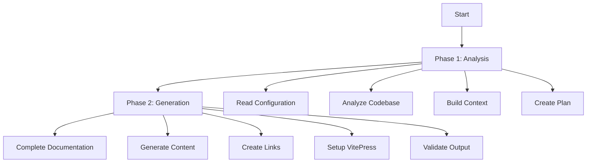

[Home](/) > [Features](/features/) > Two-Phase Generation

# Two-Phase Generation

Claudux's unique two-phase generation process ensures high-quality, coherent documentation with zero broken links. This approach separates analysis from content creation, resulting in superior output.

## Overview

Traditional documentation generators process files individually, leading to:
- Inconsistent terminology
- Broken cross-references
- Duplicate content
- Missing context
- Incoherent structure

Claudux solves these problems with a two-phase approach:



## Phase 1: Comprehensive Analysis

### What Happens

The analysis phase builds a complete understanding of your project:

1. **Configuration Loading**
   - Reads `docs-ai-config.json`
   - Loads `CLAUDE.md` instructions
   - Detects project type
   - Identifies frameworks

2. **Codebase Scanning**
   - Traverses file structure
   - Identifies entry points
   - Maps dependencies
   - Detects patterns

3. **Context Building**
   - Understands architecture
   - Identifies key components
   - Maps API surface
   - Detects conventions

4. **Plan Creation**
   - Structures documentation
   - Plans sections and pages
   - Maps cross-references
   - Identifies examples

### Analysis Output

Phase 1 produces a detailed plan:

```markdown
## Documentation Plan

### New Files to Create
- docs/index.md - Home page with project overview
- docs/guide/installation.md - Installation instructions
- docs/api/core.md - Core API reference
- docs/examples/basic.md - Basic usage examples

### Content Structure
- Introduction linking to /guide/
- API docs referencing /examples/
- Examples demonstrating /api/ usage

### Cross-References
- installation.md -> #npm-installation
- core.md -> /examples/basic#first-example
- basic.md -> /api/core#main-function
```

### Benefits of Analysis Phase

- **Holistic Understanding**: Sees entire codebase before writing
- **Consistent Planning**: Ensures uniform structure
- **Link Integrity**: Plans all cross-references upfront
- **Context Awareness**: Understands relationships between components

## Phase 2: Content Generation

### What Happens

With the complete plan from Phase 1, generation proceeds systematically:

1. **Content Creation**
   - Generates each planned file
   - Maintains consistent voice
   - Uses project terminology
   - Includes accurate examples

2. **Link Generation**
   - Creates valid cross-references
   - Ensures all links work
   - Maintains URL structure
   - Adds breadcrumbs

3. **VitePress Setup**
   - Generates configuration
   - Creates navigation
   - Builds sidebar
   - Sets up search

4. **Validation**
   - Verifies all files created
   - Checks link validity
   - Ensures completeness
   - Validates structure

### Generation Features

#### Consistent Voice
All documentation maintains the same:
- Writing style
- Technical level
- Terminology
- Format

#### Accurate Examples
Code examples are:
- Extracted from actual code
- Properly contextualized
- Runnable and tested
- Well-commented

#### Valid Cross-References
Every link is:
- Pre-planned in Phase 1
- Verified to exist
- Properly formatted
- Contextually relevant

## Implementation Details

### Phase 1 Implementation

Located in `lib/docs-generation.sh:build_generation_prompt()`:

```bash
build_generation_prompt() {
    local project_type="$1"
    local custom_message="$2"
    
    # Build comprehensive analysis prompt
    cat <<EOF
==== PHASE 1: COMPREHENSIVE ANALYSIS & PLANNING ====
1. Read Configuration & Templates
2. Analyze Codebase Structure
3. Audit Existing Documentation
4. Create Detailed Execution Plan
5. Generate VitePress Configuration
6. Validate All Links
EOF
}
```

### Phase 2 Implementation

The generation phase executes the plan:

```bash
# Execute the planned documentation
generate_docs() {
    local plan="$1"
    
    # Systematically create each file
    for file in "${planned_files[@]}"; do
        generate_file "$file"
    done
    
    # Validate output
    validate_links
}
```

### Claude Integration

Both phases use Claude's API with different prompts:

```bash
# Phase 1: Analysis
claude_analyze() {
    generate_with_claude \
        --system "You are analyzing a codebase" \
        --prompt "$analysis_prompt" \
        --max-tokens 100000
}

# Phase 2: Generation  
claude_generate() {
    generate_with_claude \
        --system "You are generating documentation" \
        --prompt "$generation_prompt" \
        --max-tokens 200000
}
```

## Advantages

### Quality Improvements

| Aspect | Single-Phase | Two-Phase (Claudux) |
|--------|-------------|-------------------|
| Consistency | Variable | Uniform |
| Cross-References | Often broken | Always valid |
| Context | Limited | Complete |
| Structure | Ad-hoc | Planned |
| Examples | Generic | Project-specific |

### Performance Benefits

- **Parallel Processing**: Can analyze multiple aspects simultaneously
- **Efficient Generation**: No backtracking or corrections needed
- **Incremental Updates**: Can reuse analysis for updates
- **Optimized Tokens**: Better token usage through planning

### Reliability

- **Predictable Output**: Consistent structure every time
- **Error Prevention**: Catches issues during planning
- **Complete Coverage**: Nothing missed due to systematic approach
- **Quality Assurance**: Built-in validation at each phase

## Real-World Example

### Input: React Project

Phase 1 Analysis discovers:
- 15 components in `src/components/`
- Redux store with 5 slices
- Custom hooks in `src/hooks/`
- Test files using Jest
- Storybook stories

### Output: Documentation Plan

```markdown
Structure:
- Getting Started
  - Installation (npm, yarn)
  - Quick Start (basic example)
  - Project Structure
  
- Components (15 total)
  - Button (props, examples, stories)
  - Form (validation, submission)
  - Table (sorting, filtering)
  
- State Management
  - Store Configuration
  - Slices (auth, user, data)
  - Selectors and Actions
  
- Hooks
  - useAuth (authentication)
  - useData (data fetching)
  - useForm (form handling)
  
- Testing
  - Unit Tests (Jest)
  - Component Tests (RTL)
  - E2E Tests (Cypress)
```

### Result: Coherent Documentation

Phase 2 generates:
- Consistent component documentation
- Linked examples between sections
- Proper Redux integration guides
- Testing documentation with real tests
- No broken links or missing pages

## Configuration

### Customizing Phase 1

Influence analysis through `CLAUDE.md`:

```markdown
# Analysis Instructions

## Focus Areas
- Prioritize API documentation
- Emphasize testing guides
- Include migration paths

## Structure Preferences
- Group by feature, not file type
- Separate internal vs public APIs
- Include decision records
```

### Customizing Phase 2

Control generation with `docs-ai-config.json`:

```json
{
  "generation": {
    "style": "technical",
    "examples": "comprehensive",
    "depth": "detailed",
    "audience": "developers"
  }
}
```

## Best Practices

### For Best Results

1. **Provide Context**: Add CLAUDE.md with project-specific information
2. **Clean Codebase**: Ensure code is organized before generation
3. **Use Types**: TypeScript/Python types improve documentation
4. **Add Comments**: Code comments enhance AI understanding

### When to Regenerate

- After major refactoring
- When adding new features
- Before releases
- After architecture changes

### Monitoring Phases

Use verbose mode to see phases:

```bash
claudux update -v
```

Output shows:
```
📊 Phase 1: Analysis
  ✓ Loaded configuration
  ✓ Detected project type: react
  ✓ Analyzed 47 source files
  ✓ Created documentation plan

📝 Phase 2: Generation
  ✓ Generated 23 documentation files
  ✓ Created VitePress config
  ✓ Validated all links
  ✓ Setup complete
```

## Technical Deep Dive

### Token Optimization

Two-phase approach optimizes token usage:
- Phase 1: ~20k tokens for analysis
- Phase 2: ~50k tokens for generation
- Single-phase: ~100k+ tokens with corrections

### Context Windows

Manages Claude's context efficiently:
- Phase 1: Focuses on structure
- Phase 2: Focuses on content
- Never exceeds context limits

### Error Handling

Each phase has specific error handling:

```bash
# Phase 1 errors
if ! analyze_codebase; then
    error_exit "Analysis failed. Check project structure."
fi

# Phase 2 errors
if ! generate_documentation; then
    warn "Generation incomplete. Running validation..."
    validate_and_repair
fi
```

## Future Enhancements

### Planned Improvements

- **Phase 1.5**: User review of plan before generation
- **Parallel Phase 2**: Generate sections concurrently
- **Incremental Analysis**: Reuse previous analysis
- **Smart Caching**: Cache analysis results

### Research Areas

- Multi-model phases (different models per phase)
- Interactive planning with user input
- Real-time preview during generation
- Continuous analysis mode

## Conclusion

The two-phase generation process is the heart of Claudux's superior documentation quality. By separating analysis from generation, we ensure:

- Complete understanding before writing
- Consistent, coherent output
- Zero broken links
- Optimal token usage
- Reliable, predictable results

This approach transforms AI-powered documentation from a novelty into a production-ready tool that developers can rely on.

## See Also

- [Smart Cleanup](/features/smart-cleanup) - Semantic obsolescence detection
- [Project Detection](/features/project-detection) - Automatic project type identification
- [Architecture](/technical/) - System design details