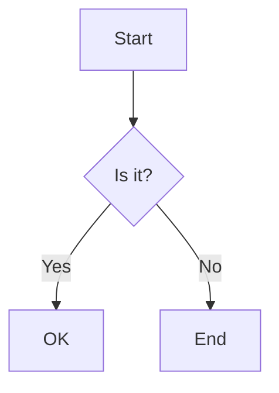

[Home](/) > [Features](/features/) > VitePress Integration

# VitePress Integration

Claudux seamlessly integrates with VitePress to provide a beautiful, fast, and feature-rich documentation site out of the box.

## Why VitePress?

VitePress offers:
- ⚡ Lightning-fast static site generation
- 🎨 Beautiful default theme
- 🔍 Built-in search functionality
- 📱 Mobile-responsive design
- 🌙 Dark mode support
- 🚀 Optimized for documentation

## Automatic Setup

When you run `claudux update`, VitePress is automatically configured:

```bash
claudux update
```

This:
1. Generates VitePress configuration
2. Creates navigation structure
3. Sets up sidebar
4. Configures search
5. Applies custom theme

## Generated Configuration

Claudux creates a complete `docs/.vitepress/config.ts`:

```typescript
import { defineConfig } from 'vitepress'

export default defineConfig({
  title: 'Your Project',
  description: 'AI-generated documentation',
  
  // Clean URLs without .html
  cleanUrls: true,
  
  // Theme configuration
  themeConfig: {
    // Navigation
    nav: [...],
    
    // Sidebar
    sidebar: {...},
    
    // Search
    search: {
      provider: 'local'
    },
    
    // Social links
    socialLinks: [
      { icon: 'github', link: 'https://github.com/...' }
    ]
  }
})
```

## Features Enabled

### Local Search

Full-text search works immediately:
- No external dependencies
- Instant results
- Keyboard shortcuts (Cmd/Ctrl + K)

### Responsive Sidebar

Auto-generated sidebar with:
- Collapsible sections
- Active page highlighting
- Mobile-friendly navigation
- Multi-level hierarchy

### Dark Mode

Automatic dark mode with:
- System preference detection
- Manual toggle
- Persistent selection
- Optimized color schemes

### Syntax Highlighting

Code blocks with:
- Language detection
- Line numbers
- Copy button
- Theme support

## Custom Theme

Claudux includes custom enhancements in `docs/.vitepress/theme/`:

### Breadcrumb Navigation

Every page includes breadcrumbs:
```markdown
[Home](/) > [Guide](/guide/) > Current Page
```

### Enhanced Styles

Custom CSS for better readability:
```css
/* docs/.vitepress/theme/custom.css */
.vp-doc h2 {
  margin-top: 2rem;
  padding-top: 1rem;
  border-top: 1px solid var(--vp-c-divider);
}
```

### Component Support

Vue components for rich content:
```vue
<!-- docs/.vitepress/theme/components/Feature.vue -->
<template>
  <div class="feature">
    <h3>{{ title }}</h3>
    <p>{{ description }}</p>
  </div>
</template>
```

## Development Server

Start the dev server instantly:

```bash
claudux serve
```

Features:
- Hot module replacement
- Instant updates
- Error overlay
- Network access

Output:
```
  vitepress dev docs

  ➜  Local:   http://localhost:5173/
  ➜  Network: http://192.168.1.100:5173/
```

## Building for Production

Build static files for deployment:

```bash
cd docs
npm run build
```

Output in `docs/.vitepress/dist/`:
```
dist/
├── index.html
├── guide/
│   ├── index.html
│   └── installation.html
├── assets/
│   ├── style.css
│   └── chunks/
└── hashmap.json
```

## Configuration Details

### Navigation Structure

```typescript
nav: [
  { text: 'Guide', link: '/guide/' },
  { text: 'API', link: '/api/' },
  {
    text: 'Resources',
    items: [
      { text: 'FAQ', link: '/faq' },
      { text: 'Examples', link: '/examples/' }
    ]
  }
]
```

### Sidebar Configuration

```typescript
sidebar: {
  '/': [
    {
      text: 'Getting Started',
      collapsed: false,
      items: [
        { text: 'Introduction', link: '/' },
        { text: 'Installation', link: '/guide/installation' }
      ]
    }
  ],
  '/guide/': [
    // Guide-specific sidebar
  ]
}
```

### Search Options

```typescript
search: {
  provider: 'local',
  options: {
    locales: {
      root: {
        translations: {
          button: {
            buttonText: 'Search',
            buttonAriaLabel: 'Search docs'
          }
        }
      }
    }
  }
}
```

## Customization

### Modify Theme

Edit `docs/.vitepress/config.ts`:

```typescript
themeConfig: {
  logo: '/logo.svg',
  siteTitle: 'Custom Title',
  
  footer: {
    message: 'Released under MIT License',
    copyright: 'Copyright © 2024'
  }
}
```

### Add Custom Components

Create in `docs/.vitepress/theme/components/`:

```vue
<script setup>
import CustomComponent from './components/CustomComponent.vue'
</script>

# Documentation

<CustomComponent />
```

### Extend Default Theme

```typescript
// docs/.vitepress/theme/index.ts
import DefaultTheme from 'vitepress/theme'
import './custom.css'

export default {
  extends: DefaultTheme,
  enhanceApp({ app }) {
    // Register global components
  }
}
```

## Deployment

### GitHub Pages

```yaml
# .github/workflows/deploy.yml
name: Deploy
on:
  push:
    branches: [main]

jobs:
  deploy:
    runs-on: ubuntu-latest
    steps:
      - uses: actions/checkout@v3
      - uses: actions/setup-node@v3
      - run: npm ci
      - run: npm run docs:build
      - uses: peaceiris/actions-gh-pages@v3
        with:
          github_token: ${{ secrets.GITHUB_TOKEN }}
          publish_dir: docs/.vitepress/dist
```

### Netlify

```toml
# netlify.toml
[build]
  command = "cd docs && npm run build"
  publish = "docs/.vitepress/dist"
```

### Vercel

```json
// vercel.json
{
  "buildCommand": "cd docs && npm run build",
  "outputDirectory": "docs/.vitepress/dist"
}
```

## Advanced Features

### Mermaid Diagrams

```markdown

```

### Custom Containers

```markdown
::: info
This is an info box.
:::

::: warning
This is a warning.
:::

::: danger
This is a danger zone.
:::
```

### Frontmatter

```markdown
---
title: Custom Title
description: Page description
head:
  - - meta
    - name: keywords
      content: documentation, vitepress
---
```

## Performance

VitePress provides excellent performance:

- **Fast Initial Load**: Pre-rendered HTML
- **Quick Navigation**: Client-side routing
- **Lazy Loading**: Code splitting
- **Optimized Assets**: Automatic optimization

### Lighthouse Scores

Typical scores for Claudux docs:
- Performance: 95-100
- Accessibility: 100
- Best Practices: 100
- SEO: 100

## Troubleshooting

### Port Already in Use

```bash
# Use different port
VITE_PORT=3000 claudux serve
```

### Build Errors

```bash
# Clear cache and rebuild
rm -rf docs/node_modules docs/.vitepress/cache
cd docs && npm install && npm run build
```

### Search Not Working

```bash
# Rebuild search index
cd docs
npm run build
```

## Integration with Claudux

### Automatic Updates

VitePress config updates with documentation:

```bash
claudux update
# Regenerates both content and config
```

### Smart Detection

Claudux detects existing VitePress:

```bash
# Preserves custom config
claudux update --preserve-config
```

### Custom Templates

Add VitePress-specific templates:

```bash
lib/templates/vitepress/
├── config.template.ts
├── theme/
│   └── custom.css
└── components/
    └── Feature.vue
```

## Best Practices

1. **Keep Config Clean**: Let Claudux manage the base config
2. **Use Frontmatter**: Add metadata to pages
3. **Optimize Images**: Use appropriate formats and sizes
4. **Test Locally**: Always preview with `claudux serve`
5. **Custom Styles**: Add to `custom.css`, not config

## Conclusion

VitePress integration makes Claudux documentation beautiful, fast, and functional from day one. With zero configuration required and extensive customization available, it's the perfect foundation for your project documentation.

## See Also

- [Configuration Guide](/guide/configuration) - Customize VitePress settings
- [Commands Reference](/guide/commands) - Serve command details
- [Examples](/examples/) - Real-world VitePress customizations