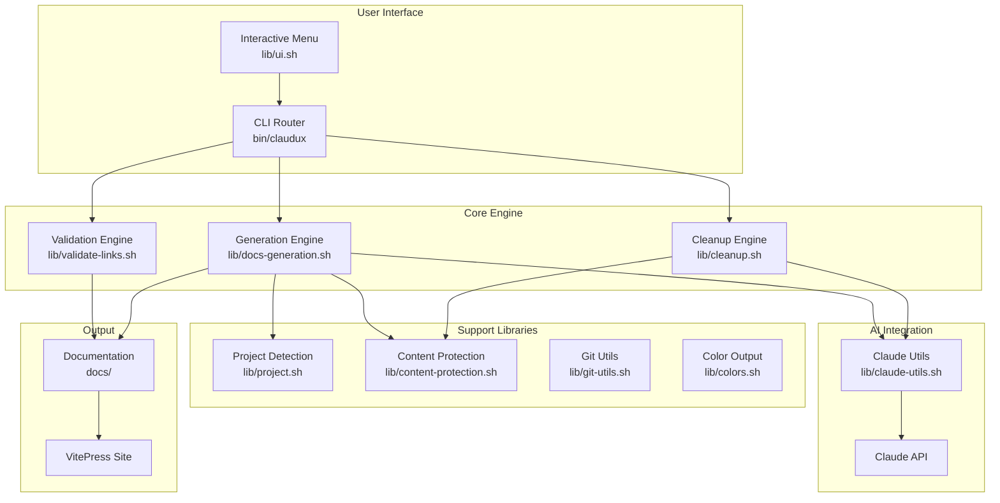
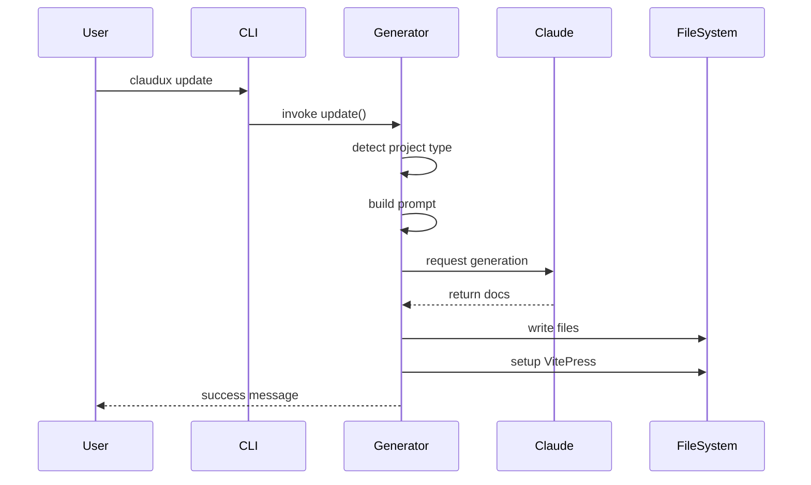
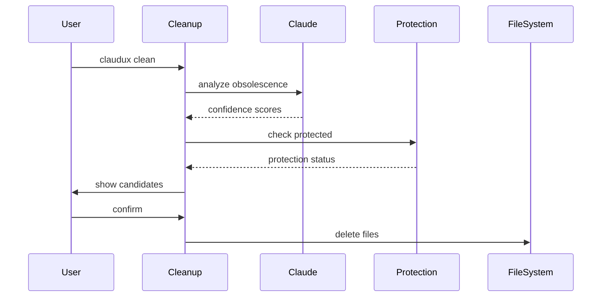

[Home](/) > Technical

# Technical Architecture

Claudux is built following Unix philosophy: modular components that do one thing well, composed together to create powerful functionality.

## System Architecture



## Design Principles

### Unix Philosophy

1. **Modularity**: Each component has a single responsibility
2. **Composability**: Components work together seamlessly
3. **Simplicity**: Clear, readable Bash code
4. **Robustness**: Comprehensive error handling
5. **Portability**: Works across Unix-like systems

### Core Concepts

#### Two-Phase Generation
Separates analysis from content creation for superior quality:
- Phase 1: Complete codebase analysis and planning
- Phase 2: Systematic documentation generation

#### Semantic Analysis
Uses AI to understand code meaning, not just syntax:
- Identifies truly obsolete content
- Preserves relevant documentation
- Maintains context and relationships

#### Protection Layers
Multiple mechanisms ensure content safety:
- Built-in patterns
- Custom markers
- Configuration files
- Git integration

## Directory Structure

```
claudux/
├── bin/
│   └── claudux              # Main entry point
├── lib/
│   ├── claude-utils.sh      # AI integration
│   ├── cleanup.sh           # Cleanup logic
│   ├── colors.sh            # Terminal colors
│   ├── content-protection.sh # Protection logic
│   ├── docs-generation.sh   # Generation engine
│   ├── git-utils.sh         # Git integration
│   ├── project.sh           # Project detection
│   ├── server.sh            # Dev server
│   ├── ui.sh                # User interface
│   ├── validate-links.sh    # Link validation
│   └── vitepress/
│       ├── setup.sh         # VitePress setup
│       ├── config.template.ts # Config template
│       └── theme/           # Custom theme
└── lib/templates/
    ├── generic/             # Generic templates
    ├── react/               # React templates
    ├── nextjs/              # Next.js templates
    └── ...                  # Other frameworks
```

## Component Architecture

### Entry Point (bin/claudux)

The main router that:
- Resolves script location
- Sources library modules
- Handles command routing
- Manages global options
- Provides error handling

Key features:
```bash
# Robust symlink resolution
resolve_script_path() {
    # Handles up to 10 symlink levels
    # Works across macOS and Linux
}

# File locking for safety
acquire_lock() {
    # Prevents concurrent execution
    # Uses flock when available
}
```

### Generation Engine (lib/docs-generation.sh)

The core documentation generator:

```bash
update() {
    # 1. Load configuration
    load_project_config
    
    # 2. Detect project type
    local project_type=$(detect_project_type)
    
    # 3. Build generation prompt
    local prompt=$(build_generation_prompt)
    
    # 4. Generate with Claude
    generate_with_claude "$prompt"
    
    # 5. Setup VitePress
    setup_vitepress
    
    # 6. Clean obsolete files
    cleanup_docs_silent
}
```

### AI Integration (lib/claude-utils.sh)

Abstracts Claude API interaction:

```bash
generate_with_claude() {
    local prompt="$1"
    local model="${FORCE_MODEL:-opus}"
    
    # Build request
    local request=$(build_claude_request "$prompt" "$model")
    
    # Execute with retry logic
    local response=$(execute_with_retry "$request")
    
    # Format output
    format_claude_output "$response"
}
```

### Project Detection (lib/project.sh)

Intelligent project type identification:

```bash
detect_project_type() {
    # Priority-based detection
    # 1. Framework-specific (Next.js, Rails)
    # 2. Language + framework (React, Vue)
    # 3. Language-only (Python, Rust)
    # 4. Generic indicators
    # 5. Fallback to generic
}
```

## Data Flow

### Documentation Generation Flow



### Cleanup Flow



## Error Handling

### Layered Error Strategy

1. **Function Level**: Each function validates inputs
2. **Module Level**: Modules handle their errors
3. **Script Level**: Main script catches all errors
4. **User Level**: Clear error messages

### Error Patterns

```bash
# Input validation
validate_input() {
    [[ -z "$1" ]] && error_exit "Input required"
}

# Command existence
check_command() {
    command -v "$1" >/dev/null 2>&1 || \
        error_exit "Command not found: $1"
}

# File operations
safe_write() {
    local file="$1"
    local content="$2"
    
    # Create backup
    [[ -f "$file" ]] && cp "$file" "$file.bak"
    
    # Write with error handling
    echo "$content" > "$file" || {
        [[ -f "$file.bak" ]] && mv "$file.bak" "$file"
        error_exit "Failed to write: $file"
    }
}
```

## Performance Optimization

### Token Management

Optimizes Claude API token usage:
- Chunks large codebases
- Caches analysis results
- Reuses prompts when possible
- Batches related requests

### Parallel Processing

Where safe, operations run in parallel:
```bash
# Parallel validation
validate_internal_links &
validate_external_links &
wait
```

### Efficient File Operations

```bash
# Use find with -exec
find docs -name "*.md" -exec process_file {} \;

# Batch operations
cat file_list | xargs -P 4 process_files
```

## Security Considerations

### Input Sanitization

All user input is sanitized:
```bash
sanitize_path() {
    local path="$1"
    # Remove dangerous characters
    path="${path//[^a-zA-Z0-9\/\.\-\_]/}"
    # Prevent directory traversal
    path="${path//../}"
    echo "$path"
}
```

### Protected Operations

Sensitive operations require confirmation:
- File deletion
- Overwriting existing docs
- External network requests

### Credential Management

- Never logs API keys
- Uses environment variables
- Respects .gitignore
- Protects private directories

## Platform Compatibility

### macOS Support

Primary development platform:
- Uses `md5` for checksums
- Handles macOS sed syntax
- Supports Homebrew paths

### Linux Support

Full compatibility with:
- Uses `md5sum` for checksums
- GNU sed syntax
- Standard FHS paths

### Cross-Platform Code

```bash
# Platform detection
get_md5_command() {
    if command -v md5sum >/dev/null 2>&1; then
        echo "md5sum"
    elif command -v md5 >/dev/null 2>&1; then
        echo "md5 -r"
    else
        error_exit "No MD5 command found"
    fi
}

# Usage
MD5_CMD=$(get_md5_command)
checksum=$($MD5_CMD "$file" | cut -d' ' -f1)
```

## Testing Strategy

### Unit Testing

Each function is testable:
```bash
test_detect_project_type() {
    cd test/fixtures/react-app
    result=$(detect_project_type)
    assert_equals "react" "$result"
}
```

### Integration Testing

End-to-end scenarios:
```bash
test_full_generation() {
    claudux update
    assert_directory_exists "docs"
    assert_file_exists "docs/.vitepress/config.ts"
}
```

### Manual Testing

Before releases:
1. Test on macOS and Linux
2. Test with various project types
3. Test error conditions
4. Test cleanup safety

## Future Architecture

### Planned Enhancements

1. **Plugin System**: Extensible architecture for custom generators
2. **Caching Layer**: Speed up regeneration
3. **Distributed Generation**: Parallel processing for large codebases
4. **Real-time Updates**: Watch mode for continuous generation

### Research Areas

- Multi-model generation (different models for different tasks)
- Incremental generation (only update changed sections)
- Language-specific analyzers
- Custom AST parsing

## Conclusion

Claudux's architecture demonstrates that powerful tools can be built with simple, modular components. By following Unix philosophy and focusing on composition over complexity, we've created a robust, maintainable, and extensible documentation generator.

## See Also

- [Coding Patterns](/technical/patterns) - Development patterns and conventions
- [Modules](/technical/modules) - Detailed module documentation
- [Contributing](/development/contributing) - How to contribute