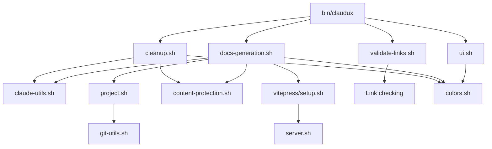

[Home](/) > [Technical](/technical/) > Modules

# Module Documentation

Detailed documentation for each Claudux library module, including purpose, dependencies, and implementation details.

## Module Overview

| Module | Lines | Purpose |
|--------|-------|---------|
| `bin/claudux` | ~320 | Main entry point and command router |
| `lib/colors.sh` | ~50 | Terminal color output utilities |
| `lib/project.sh` | ~120 | Project detection and configuration |
| `lib/claude-utils.sh` | ~150 | Claude AI integration layer |
| `lib/docs-generation.sh` | ~250 | Documentation generation engine |
| `lib/cleanup.sh` | ~180 | Obsolete file cleanup logic |
| `lib/content-protection.sh` | ~100 | Content protection mechanisms |
| `lib/server.sh` | ~80 | Development server management |
| `lib/ui.sh` | ~200 | User interface and menus |
| `lib/validate-links.sh` | ~150 | Link validation and repair |
| `lib/git-utils.sh` | ~100 | Git repository utilities |

## bin/claudux

**Purpose:** Main entry point that routes commands to appropriate functions.

**Key Features:**
- Robust symlink resolution
- File locking for concurrent safety
- Command routing
- Global option handling

**Critical Functions:**

```bash
resolve_script_path()
# Resolves script location through up to 10 symlink levels
# Returns: Absolute path to script directory

acquire_lock()
# Acquires file lock to prevent concurrent execution
# Returns: 0 on success, 1 on failure

main()
# Main command router
# Parameters: All command-line arguments
```

**Dependencies:**
- All lib/*.sh modules

**Error Handling:**
- Validates all dependencies before execution
- Provides clear error messages for missing components
- Traps interrupts for graceful shutdown

## lib/colors.sh

**Purpose:** Provides terminal color output and formatting utilities.

**Key Functions:**

```bash
print_color() {
    local color="$1"
    local message="$2"
    
    case "$color" in
        RED)    echo -e "\033[0;31m${message}\033[0m" ;;
        GREEN)  echo -e "\033[0;32m${message}\033[0m" ;;
        YELLOW) echo -e "\033[0;33m${message}\033[0m" ;;
        BLUE)   echo -e "\033[0;34m${message}\033[0m" ;;
        CYAN)   echo -e "\033[0;36m${message}\033[0m" ;;
        *)      echo "$message" ;;
    esac
}

error_exit()  # Print error and exit
warn()        # Print warning
info()        # Print info
success()     # Print success
```

**Color Codes:**
- RED: Errors and failures
- GREEN: Success messages
- YELLOW: Warnings
- BLUE: Headers and titles
- CYAN: Info messages

**Environment:**
- Respects `NO_COLOR` environment variable

## lib/project.sh

**Purpose:** Detects project type and loads configuration.

**Key Functions:**

```bash
detect_project_type()
# Analyzes files to determine project type
# Returns: Project type string

load_project_config()
# Loads docs-ai-config.json if present
# Sets: PROJECT_NAME, PROJECT_TYPE, etc.

find_project_logo()
# Searches for project logo file
# Returns: Path to logo or empty

get_project_config()
# Gets configuration template for project type
# Parameters: project_type
# Returns: Path to config template
```

**Detection Priority:**
1. Framework-specific (Next.js, Rails)
2. Language + framework (React, Vue)
3. Language-only (Python, Rust)
4. Generic indicators
5. Fallback to generic

**Supported Types:**
- nextjs, react, ios, python, rust, go
- rails, android, flutter, vue, angular
- generic (fallback)

## lib/claude-utils.sh

**Purpose:** Abstracts Claude AI API interaction.

**Key Functions:**

```bash
check_claude()
# Verifies Claude CLI installation and auth
# Exits on failure

get_model_settings()
# Gets model configuration
# Sets: MODEL, MAX_TOKENS, TEMPERATURE

generate_with_claude()
# Generates content using Claude
# Parameters: prompt, optional model
# Returns: Generated content

show_progress()
# Shows progress spinner
# Parameters: message

format_claude_output()
# Formats raw API output
# Parameters: raw_output
# Returns: Formatted text
```

**Model Selection:**
- Default: opus (highest quality)
- Override: `FORCE_MODEL` environment variable
- Options: opus, sonnet, haiku

**Error Handling:**
- Retry logic for transient failures
- Token limit management
- Timeout handling

## lib/docs-generation.sh

**Purpose:** Core documentation generation engine.

**Key Functions:**

```bash
build_generation_prompt()
# Builds comprehensive generation prompt
# Parameters: project_type, custom_message
# Returns: Complete prompt

update()
# Main update function
# Parameters: Command-line arguments
# Process: Detect → Analyze → Generate → Setup → Clean

generate_docs_map()
# Creates documentation structure map
# Returns: Markdown map

setup_vitepress()
# Configures VitePress
# Creates: config.ts, theme files
```

**Two-Phase Process:**
1. Analysis Phase:
   - Load configuration
   - Analyze codebase
   - Create plan
   - Generate config

2. Generation Phase:
   - Create documentation
   - Setup VitePress
   - Validate links
   - Clean obsolete

**Templates:**
- Uses project-specific templates
- Applies CLAUDE.md instructions
- Respects configuration

## lib/cleanup.sh

**Purpose:** Identifies and removes obsolete documentation.

**Key Functions:**

```bash
cleanup_docs()
# Interactive cleanup with confirmation
# Shows obsolete files and requests approval

cleanup_docs_silent()
# Silent cleanup for automation
# Used by update process

recreate_docs()
# Deletes all docs and regenerates
# Parameters: Optional message

analyze_obsolete_docs()
# Identifies obsolete files
# Returns: List of obsolete paths
```

**Obsolescence Detection:**
- Semantic analysis via AI
- 95% confidence threshold
- Protected content checking
- Reference validation

**Protection:**
- Never deletes protected patterns
- Preserves custom markers
- Respects .clauduxignore

## lib/content-protection.sh

**Purpose:** Protects sensitive and custom content.

**Key Functions:**

```bash
is_protected_path()
# Checks if path is protected
# Parameters: path
# Returns: 0 if protected

get_protection_markers()
# Returns protection marker patterns
# Used for content preservation

strip_protected_content()
# Extracts protected sections
# Parameters: file
# Creates: file.protected

restore_protected_content()
# Restores protected sections
# Parameters: file
```

**Protection Layers:**
1. Built-in patterns (private/, .env, etc.)
2. Protection markers in files
3. .clauduxignore patterns
4. .gitignore integration

**Markers:**
```
CLAUDUX:PROTECTED:START
CLAUDUX:PROTECTED:END
```

## lib/server.sh

**Purpose:** Manages VitePress development server.

**Key Functions:**

```bash
serve()
# Starts development server
# Installs deps if needed
# Finds available port

find_available_port()
# Finds free port starting from 3000
# Returns: Available port number

install_vitepress()
# Installs VitePress dependencies
# Only if not present
```

**Port Selection:**
- Default: 5173
- Fallback range: 3000-3100
- Environment: `VITE_PORT`

**Features:**
- Auto-install dependencies
- Port conflict resolution
- Browser auto-open

## lib/ui.sh

**Purpose:** User interface and interaction utilities.

**Key Functions:**

```bash
show_header()
# Displays Claudux banner

show_menu()
# Shows interactive menu
# Returns: Selected option

show_help()
# Displays help information
# Parameters: Optional command

create_claudux_md()
# Generates CLAUDE.md template
# Creates: CLAUDE.md or claudux.md

confirm()
# Gets user confirmation
# Parameters: message
# Returns: 0 for yes, 1 for no
```

**Menu Options:**
1. Generate/Update Documentation
2. Serve Documentation Locally
3. Clean Obsolete Files
4. Validate Links
5. Create CLAUDE.md Template
6. Exit

**User Experience:**
- Color-coded output
- Clear prompts
- Keyboard shortcuts
- Progress indicators

## lib/validate-links.sh

**Purpose:** Validates and repairs documentation links.

**Key Functions:**

```bash
validate_links()
# Main validation function
# Options: --auto-fix, --external

check_internal_links()
# Validates internal doc links
# Returns: Broken link list

check_external_links()
# Validates external URLs
# Parameters: timeout

repair_links()
# Auto-repairs broken links
# Parameters: broken_links
```

**Validation Types:**
- Internal links (markdown references)
- External URLs (with timeout)
- Anchor links (#sections)
- File existence

**Repair Actions:**
- Update incorrect paths
- Create missing files
- Fix anchor references

## lib/git-utils.sh

**Purpose:** Git repository integration utilities.

**Key Functions:**

```bash
ensure_git_repo()
# Verifies git repository
# Returns: 0 if repo, 1 otherwise

show_git_status()
# Shows git status summary

show_detailed_changes()
# Shows detailed diff

get_git_remote()
# Gets remote repository URL
# Returns: Remote URL

extract_github_info()
# Extracts GitHub user/repo
# Sets: GITHUB_USER, GITHUB_REPO
```

**Features:**
- Repository detection
- Remote URL parsing
- Change tracking
- GitHub integration

## lib/vitepress/setup.sh

**Purpose:** VitePress configuration and setup.

**Key Functions:**

```bash
setup_vitepress()
# Main setup function
# Creates config and theme

generate_sidebar_config()
# Generates sidebar structure
# Returns: Sidebar configuration

install_dependencies()
# Installs npm packages
# Only if needed
```

**Generated Files:**
- `.vitepress/config.ts`
- `.vitepress/theme/`
- Package.json scripts

## Module Interactions



## Best Practices

### Module Design

1. **Single Responsibility**: Each module has one clear purpose
2. **Minimal Dependencies**: Import only what's needed
3. **Clear Interface**: Well-defined public functions
4. **Error Handling**: Comprehensive error checking
5. **Documentation**: Clear function comments

### Module Testing

Test modules individually:

```bash
# Test project detection
source lib/project.sh
project_type=$(detect_project_type)
echo "Type: $project_type"

# Test color output
source lib/colors.sh
print_color "GREEN" "Test message"
```

### Module Extension

Add new modules:

1. Create `lib/new-module.sh`
2. Add to `REQUIRED_LIBS` in `bin/claudux`
3. Document functions
4. Add tests

## Conclusion

Claudux's modular architecture ensures maintainability, testability, and extensibility. Each module serves a specific purpose while working together to provide comprehensive documentation generation capabilities.

## See Also

- [Architecture](/technical/) - System architecture
- [Patterns](/technical/patterns) - Coding patterns
- [API Reference](/api/library) - Function reference